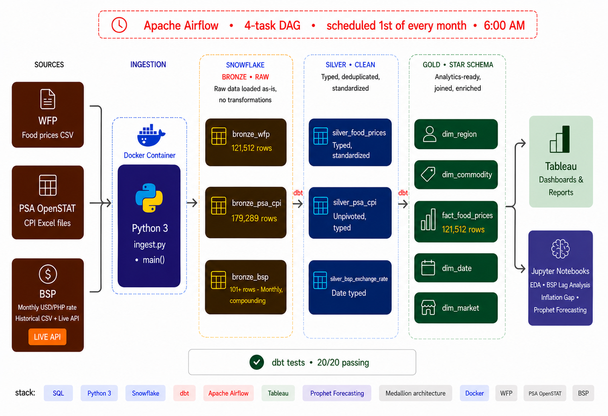
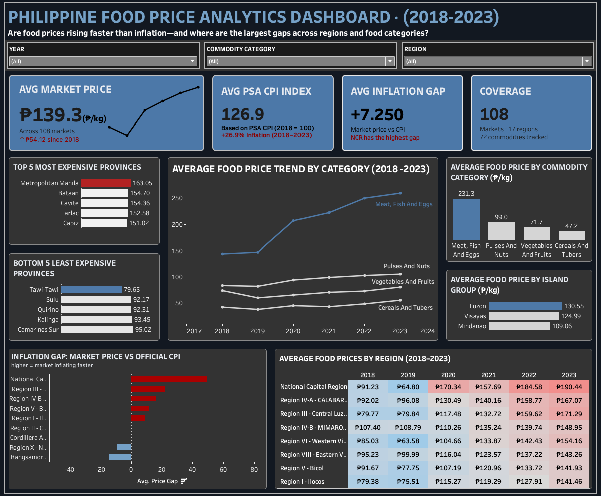

# Philippine Food Price Analytics Pipeline

End-to-end cloud ELT pipeline ingesting real Philippine government food price data into Snowflake, transforming through a Medallion Architecture with dbt, and serving an analytics-ready star schema to a live Tableau dashboard — fully automated via Apache Airflow on Astronomer Cloud.

[](https://public.tableau.com/app/profile/roland.dela.rosa/viz/PHFoodPriceDashboard/DASHBOARD)
[](https://www.python.org/)
[](https://www.snowflake.com/)
[](https://www.getdbt.com/)
[](https://airflow.apache.org/)
[](https://www.docker.com/)

---

## Architecture



---

## Live Dashboard

[](https://public.tableau.com/app/profile/roland.dela.rosa/viz/PHFoodPriceDashboard/DASHBOARD)

**[→ Open interactive dashboard on Tableau Public](https://public.tableau.com/app/profile/roland.dela.rosa/viz/PHFoodPriceDashboard/DASHBOARD)**

All 17 Philippine regions · 74 food commodities · 2000–2023 · Monthly granularity

---

## Table of Contents

- [Project Overview](#project-overview)
- [Tech Stack](#tech-stack)
- [Data Sources](#data-sources)
- [Project Structure](#project-structure)
- [Pipeline Design](#pipeline-design)
- [Data Quality](#data-quality)
- [Orchestration](#orchestration)
- [Analytics Layer](#analytics-layer)
- [Key Findings](#key-findings)
- [How to Run](#how-to-run)

---

## Project Overview

This pipeline ingests food price data from three real Philippine government and institutional sources, transforms it through a layered Medallion Architecture in Snowflake, and delivers an analytics-ready star schema serving a live Tableau dashboard across all 17 Philippine regions.

The pipeline runs automatically on the 1st of every month via a 4-task Airflow DAG on Astronomer Cloud — zero manual intervention after deployment. dbt handles all SQL transformations and enforces 20 data quality tests before any data reaches the Gold layer. The ingestion pipeline is fully containerized with Docker for reproducible execution on any machine.

**Engineering highlights:**

- Automated monthly ELT pipeline — no manual execution required
- Containerized ingestion pipeline via Docker — fully reproducible across any environment
- Modular ingestion layer handling three distinct source formats (CSV, Excel, live JSON API)
- BSP exchange rate ingested via append-only pattern — builds a compounding historical time series across runs
- dbt transformation workflow with full lineage across Bronze, Silver, and Gold
- 20 dbt data quality tests gate every pipeline run — bad data never reaches Gold
- Analytics-ready star schema with pre-computed `price_to_cpi_ratio` serving as the core analytical metric

---

## Tech Stack

| Layer | Tool | Purpose |
|---|---|---|
| Containerization | Docker | Packages the ingestion pipeline for reproducible execution on any machine |
| Ingestion | Python 3.12 | Fetch and load from CSV, Excel, and live JSON API into Snowflake Bronze |
| Data Warehouse | Snowflake | Cloud warehouse across all three Medallion layers |
| Transformation | dbt (dbt-snowflake) | SQL modeling, testing, and lineage documentation |
| Orchestration | Apache Airflow on Astronomer Cloud | Monthly scheduling and task dependency management |
| Visualization | Tableau Public | Live interactive dashboard |
| Analytics | pandas, Prophet, statsmodels | Post-pipeline EDA, forecasting, and lag correlation |

---

## Data Sources

| Source | Description | Format | Rows |
|---|---|---|---|
| [WFP via Kaggle](https://www.kaggle.com/datasets/usmanlovescode/philippines-food-prices-dataset) | Market food prices, 17 Philippine regions | CSV | 121,512 |
| [PSA OpenSTAT](https://openstat.psa.gov.ph/) | Official Consumer Price Index by region | Excel (3 files) | 179,289 |
| [BSP / fawazahmed0 Currency API](https://www.bsp.gov.ph/) | Monthly USD/PHP rate — 101 months historical + live API appends one row per run | CSV + JSON API | 101+ (compounding) |

---

## Project Structure

```
ph-food-price-pipeline/
│
├── dags/
│   └── ph_food_pipeline_dag.py         # Airflow DAG — 4-task monthly pipeline
│
├── data/
│   ├── raw/                            # Source files
│   │   ├── wfp_food_prices_phl.csv
│   │   ├── psa_cpi_2018_2020.xlsx
│   │   ├── psa_cpi_2021_2023.xlsx
│   │   ├── psa_cpi_2024_2026.xlsx
│   │   └── bsp_monthly_rates.csv
│   └── exports/
│       └── ph_food_price_gold.csv      # Gold layer export for notebooks
│
├── docs/
│   ├── architecture.png
│   ├── ph_food_price_dashboard.png
│   └── ph_food_price_dashboard.twbx
│
├── notebooks/
│   ├── ph_food_price_part1_eda_bsp.ipynb
│   └── ph_food_price_part2_inflation_forecasting.ipynb
│
├── ph_food_pipeline/                   # dbt project
│   ├── models/
│   │   ├── bronze/
│   │   ├── silver/
│   │   │   ├── silver_food_prices.sql
│   │   │   ├── silver_psa_cpi.sql
│   │   │   └── silver_bsp_exchange_rate.sql
│   │   └── gold/
│   │       ├── dim_region.sql
│   │       ├── dim_commodity.sql
│   │       ├── dim_date.sql
│   │       ├── dim_market.sql
│   │       └── fact_food_prices.sql
│   ├── macros/
│   │   └── generate_schema_name.sql
│   ├── seeds/
│   │   └── bsp_monthly_rates.csv
│   ├── sources.yml
│   ├── schema.yml
│   └── dbt_project.yml
│
├── src/
│   ├── config.py                       # Snowflake connection (env vars)
│   ├── ingest.py                       # Ingestion functions — WFP, PSA, BSP
│   └── categorical_insert.py
│
├── main.py                             # Pipeline entry point
├── requirements.txt                    # Python dependencies
├── Dockerfile                          # Astronomer Cloud deployment config
├── Dockerfile.pipeline                 # Docker container for local ingestion pipeline
├── .dockerignore                       # Files excluded from Docker build context
├── .env.example                        # Credential template (never commit .env)
└── README.md
```

---

## Pipeline Design

The pipeline follows an ELT pattern on Snowflake. Python ingests raw data into Bronze without transformation. dbt handles all cleaning, standardization, and modeling in Silver and Gold. The separation ensures the raw source data is always preserved and every transformation is version-controlled in SQL.

### Bronze — Raw Ingestion

Three ingestion scripts load each source into its own Bronze table in Snowflake as-is. No transformations at this layer. Bronze is the immutable audit trail.

| Table | Source | Rows |
|---|---|---|
| `bronze_wfp_food_prices` | WFP CSV | 121,512 |
| `bronze_psa_cpi` | PSA Excel (3 files) | 179,289 |
| `bronze_bsp_exchange_rate` | BSP historical CSV + live API | 101+ (compounding) |

**BSP append-only design:** Each monthly run calls the BSP API, extracts the current USD/PHP rate, and appends one new row to the Bronze table. The table is never overwritten — it compounds across every run, building a true historical time series that enables lag correlation analysis.

---

### Silver — Cleaned and Standardized

Three dbt models transform each Bronze table into a clean, typed, standardized Silver table.

- `silver_food_prices` — standardizes region and commodity names, casts dates and prices, removes duplicates via `ROW_NUMBER()` window function
- `silver_psa_cpi` — unpivots PSA CPI from wide format to long format, enabling joins to food price data
- `silver_bsp_exchange_rate` — casts date and rate columns, validates positive values

---

### Gold — Star Schema

```
fact_food_prices (121,512 rows)
    ├── dim_region      (18 rows  — 17 PH regions + national)
    ├── dim_commodity   (73 rows  — food commodities)
    ├── dim_date        (285 rows — monthly spine, Jan 2000 – Nov 2023)
    └── dim_market      (108 rows — local markets across all regions)
```

| Column | Description |
|---|---|
| `price_php` | Market price in Philippine Peso |
| `price_usd` | Price converted at historical BSP rate |
| `regional_food_cpi` | Official PSA CPI for that region and month |
| `price_to_cpi_ratio` | Market price ÷ regional CPI × 100 — core analytical metric |

---

## Data Quality

20 dbt tests enforced across all Silver and Gold models:

```
Done. PASS=20  WARN=0  ERROR=0  SKIP=0  TOTAL=20
```

Tests cover `not_null` and `unique` constraints on all primary keys, `accepted_values` on categorical columns, and `relationships` checks between the fact table and all four dimension tables.

---

## Orchestration

```
Schedule: 0 6 1 * *   →   6:00 AM on the 1st of every month

  [ingest_bronze]       Python fetches WFP, PSA, and BSP into Snowflake Bronze
        |
  [run_silver_models]   dbt cleans and standardizes all three sources
        |
  [run_gold_models]     dbt builds the star schema
        |
  [run_dbt_tests]       20 data quality checks — halts pipeline on any failure
```

---

## Analytics Layer

**Part 1 — EDA and BSP Exchange Rate Analysis**

BSP lag correlation results:

| Lag | r | p-value | Significant |
|---|---|---|---|
| 0 months | 0.32 | 0.007 | Yes |
| 1 month | 0.29 | 0.018 | Yes |
| 2 months | 0.25 | 0.042 | Yes |
| 3 months | 0.20 | 0.101 | No |

**Part 2 — Inflation Gap Analysis and Forecasting**

Prophet time series forecasting with and without BSP exchange rate as an external regressor — the BSP-enhanced model diverges from baseline during depreciation periods, confirming exchange rate adds genuine forecast signal.

---

## Key Findings

- NCR food prices run 60+ index points above official PSA CPI — the largest inflation gap nationally
- Luzon is 19.7% more expensive than Mindanao on average for the same WFP food basket
- Meat, Fish, and Eggs surged 80.6% from 2018 to 2023 — steepest increase of any commodity category
- Peso depreciation leads food price increases by 1–2 months (r=0.29, p=0.018 at lag 1)
- BARMM and Northern Mindanao show negative inflation gaps — market prices run below CPI in major agricultural production zones

---

## How to Run

### Option 1 — Docker (Recommended)

The ingestion pipeline is containerized for reproducible execution on any machine.

```bash
# Clone the repository
git clone https://github.com/rolanddelarosaph/ph-food-price-pipeline.git
cd ph-food-price-pipeline

# Copy the credential template and fill in your Snowflake credentials
cp .env.example .env
# Edit .env with your actual values

# Build the Docker image
docker build -f Dockerfile.pipeline -t ph-food-pipeline .

# Run the ingestion pipeline inside the container
docker run --env-file .env ph-food-pipeline
```

Credentials are injected at runtime via `--env-file` and never baked into the image.

---

### Option 2 — Local Python

```bash
# Clone and install
git clone https://github.com/rolanddelarosaph/ph-food-price-pipeline.git
cd ph-food-price-pipeline
pip install -r requirements.txt

# Set up credentials
cp .env.example .env
# Edit .env with your Snowflake credentials

# Initialize Snowflake schema
# Run sql/initialize_food_pipeline.sql in your Snowflake worksheet

# Run the ingestion pipeline
python main.py

# Run dbt transformations and tests
cd ph_food_pipeline
dbt deps
dbt run
dbt test
```

### Notebooks

```bash
jupyter notebook notebooks/
```

Run Part 1 before Part 2. Both notebooks read from `data/exports/ph_food_price_gold.csv`.

---

*Data: [WFP via Kaggle](https://www.kaggle.com/datasets/usmanlovescode/philippines-food-prices-dataset) · [PSA OpenSTAT](https://openstat.psa.gov.ph/) · [Bangko Sentral ng Pilipinas](https://www.bsp.gov.ph/)*
